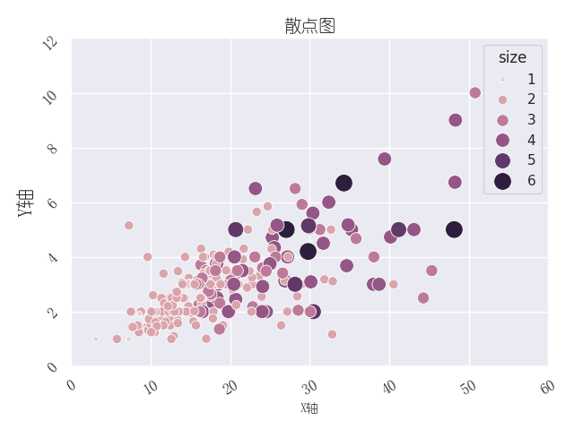
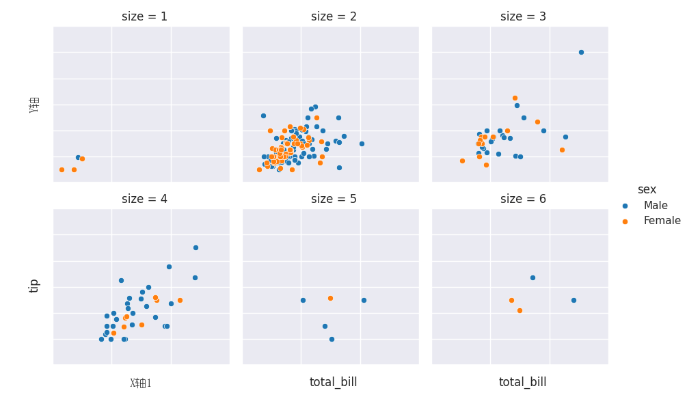

# TidySeaborn
使用Seaborn库绘图的简洁程序库，纯代码封装不含任何技术含量。

## 使用示例

```python
# 导入模块
>>> from TidySeaborn import TidySeabornFlexible
>>> import matplotlib.pyplot as plt
>>> from TidySeaborn import GetSeabornData
>>> import numpy as np
>>> iris = GetSeabornData("iris")
>>> tips = GetSeabornData("tips")
>>> penguins = GetSeabornData("penguins")
>>> planets = GetSeabornData("planets")
>>> flights = GetSeabornData("flights")
>>> titanic = GetSeabornData("titanic")
>>> diamonds = GetSeabornData("diamonds")
>>> geyser = GetSeabornData("geyser")
>>> fmri = GetSeabornData("fmri")
>>> mpg = GetSeabornData("mpg")
>>> glue = GetSeabornData("glue")
```

```python
>>> ax = TidySeabornFlexible(iris, "hist", xvarname="sepal_length", groupby="species", xlabel="数量", ylabel="个数", title="分组直方图", colormap="Set2", fontfamily="幼圆", savefilename="./image/直方图.png")
```


```python
>>> ax = TidySeabornFlexible(flights, "bar", xvarname="year", yvarname="passengers", barparamsdict={"errorbar": None, "estimator": "sum", "isshowdatalabel": 1}, xlabel="年份", ylabel="乘客", title="柱状图", xlabelsize=10, ylabelsize=16, titlesize=14, xticklabelsize=9, yticklabelsize=15, xticklabelrotation=30, yticklabelrotation=45, fontfamily="幼圆", savefilename="./image/柱状图.png")
```


```python
>>> ax = TidySeabornFlexible(flights, "box", xvarname="year", yvarname="passengers", xlabel="年份", ylabel="乘客", title="箱线图", xlabelsize=10, ylabelsize=16, titlesize=14, xticklabelsize=9, yticklabelsize=15, xticklabelrotation=30, yticklabelrotation=45, fontfamily="幼圆", savefilename="./image/箱线图.png")
```


```python
>>> ax = TidySeabornFlexible(tips, "kde", xvarname="total_bill", groupby="time", xlabel="账单费用", ylabel="密度", title="核密度曲线", xlabelsize=10, ylabelsize=16, titlesize=14, xticklabelsize=9, yticklabelsize=15, xticklabelrotation=30, yticklabelrotation=45, fontfamily="幼圆", savefilename="./image/核密度估计图.png")
```


```python
>>> ax = TidySeabornFlexible(titanic, "count", xvarname="class", groupby="survived", xlabel="阶层", ylabel="人数", title="分组分类变量柱状图", xlabelsize=10, ylabelsize=16, titlesize=14, xticklabelsize=9, yticklabelsize=15, xticklabelrotation=30, yticklabelrotation=45, fontfamily="幼圆", savefilename="./image/分类变量柱状图.png")
```


```python
>>> ax = TidySeabornFlexible(penguins, "ecdf", xvarname="bill_length_mm", groupby="species", xlabel="嘴巴长度（毫米）", ylabel="经验分布函数值", title="分组经验分布函数图", xlabelsize=10, ylabelsize=16, titlesize=14, xticklabelsize=9, yticklabelsize=15, xticklabelrotation=30, yticklabelrotation=45, fontfamily="幼圆", savefilename="./image/经验分布函数图.png")
```


```python
>>> ax = TidySeabornFlexible(penguins, "fit", xvarname="bill_length_mm", yvarname="bill_depth_mm", groupby="sex",  fitparamsdict={"col": "species", "subplot_kws": {"xlabel_1": "第1个图形的X轴标签", "xlabel_2": "第2个图形的X轴标签", "xlabel_3": "第3个图形的X轴标签", "ylabel_1": "第1个图形的Y轴标签", "ylabel_2": "第2个图形的Y轴标签", "ylabel_3": "第3个图形的Y轴标签", "xlabelsize_3": 15, "ylabelsize_1": 9, "title_1": "标题1", "title_3": "标题3"}}, fig_width=4, fig_length=4, fontfamily="幼圆", savefilename="./image/函数拟合图.png")
```


```python
>>> ax = TidySeabornFlexible(fmri, "line", xvarname="timepoint", yvarname="signal", groupby="region", lineparamsdict={"stylegroup": "event"}, xlabel="时间点", ylabel="信号值", title="时间序列线图", xlabelsize=10, ylabelsize=16, titlesize=14, xticklabelsize=9, yticklabelsize=15, xticklabelrotation=30, yticklabelrotation=45, fontfamily="幼圆", savefilename="./image/线图.png")
```


```python
>>> ax = TidySeabornFlexible(flights.pivot(index="year", columns="month", values="passengers"), "point", xlabel="X轴", ylabel="Y轴", title="点状误差线图", xlabelsize=10, ylabelsize=16, titlesize=14, xticklabelsize=9, yticklabelsize=15, xticklabelrotation=30, yticklabelrotation=45, fontfamily="幼圆", savefilename="./image/点状误差图.png")
```


```python
>>> ax = TidySeabornFlexible(tips, "scatter", xvarname="total_bill", yvarname="tip", groupby="size", scatterparamsdict={"sizes": (20,200), "sizegroup": "size"}, xlabel="X轴", ylabel="Y轴", title="散点图", xlabelsize=10, ylabelsize=16, titlesize=14, xticklabelsize=9, yticklabelsize=15, xticklabelrotation=30, yticklabelrotation=45, fontfamily="幼圆", savefilename="./image/散点图.png")
```



```python
>>> ax = TidySeabornFlexible(tips, "jitter", yvarname="total_bill", xvarname="day", groupby="sex", jitterparamsdict={"isdodge": 1}, xlabel="X轴", ylabel="Y轴", title="抖动图", xlabelsize=10, ylabelsize=16, titlesize=14, xticklabelsize=9, yticklabelsize=15, xticklabelrotation=30, yticklabelrotation=45, fontfamily="幼圆", savefilename="./image/抖动图.png")
```


```python
>>> ax = TidySeabornFlexible(titanic, "violin", xvarname="age", yvarname="class", xlabel="X轴", ylabel="Y轴", title="小提琴图", xlabelsize=10, ylabelsize=16, titlesize=14, xticklabelsize=9, yticklabelsize=15, xticklabelrotation=30, yticklabelrotation=45, fontfamily="幼圆", savefilename="./image/小提琴图.png")
```


```python
>>> ax = TidySeabornFlexible(penguins, "matrix", groupby="species", matrixparamsdict={"subwhichplot": "kde", "islegend": 1}, savefilename="./image/矩阵散点图.png")
```


```python
>>> ax = TidySeabornFlexible(penguins, "joint", xvarname="bill_length_mm", yvarname="bill_depth_mm", groupby="species", jointparamsdict={"margin_x_plottype": "violin", "margin_y_plottype": "jitter"}, savefilename="./image/联合分布图.png")
```


```python
>>> ax = TidySeabornFlexible(mpg, "resid", xvarname="horsepower", yvarname="mpg", xlabel="X轴", ylabel="Y轴", title="残差图", xlabelsize=10, ylabelsize=16, titlesize=14, xticklabelsize=9, yticklabelsize=15, xticklabelrotation=30, yticklabelrotation=45, fontfamily="幼圆", savefilename="./image/残差图.png")
```


```python
>>> ax = TidySeabornFlexible(glue.pivot(index="Model", columns="Task", values="Score"), "heat", heatparamsdict={"isannot": 1, "fmt": ".2f", "linewidths": 0.5}, xlabel="X轴", ylabel="Y轴", title="热图", xlabelsize=10, ylabelsize=16, titlesize=14, xticklabelsize=9, yticklabelsize=15, xticklabelrotation=30, yticklabelrotation=45, fontfamily="幼圆", savefilename="./image/热图.png")
```


```python
>>> ax = TidySeabornFlexible(tips, "facet", xvarname="total_bill", yvarname="tip", groupby="sex", facetparamsdict={"whichplot": "scatter", "col": "size", "col_wrap": 3, "subplot_kws": {"xlabel_4": "X轴1", "ylabel_1": "Y轴"}, "islegend": 1}, fontfamily="幼圆", savefilename="./image/分面图.png")
```

